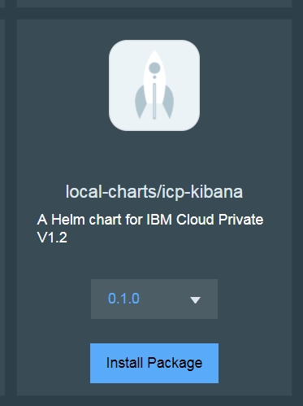

# Local Helm Repo for ICP
## Intro
IBM Cloud Private V1.2 comes with a local helm repository. The local repository sometimes is the only way to get Chart packages in an isolated environment.

However the local repo directory resides inside the container. There is no way to make persistent changes to host updated helm chart packages. In this small project, I update the default helm repo kubernetes resource for hosting persistent changes on the helm repo.

## Steps
- Clone the git
- Copy out the out of box repo from pod
```
mkdir -p icp/local_helm_repo
POD=$(kubectl get pods --selector k8s-app=unified-router -n kube-system | grep unified-router | awk -e '{print $1}')
sudo kubectl cp kube-system/$POD:/local-repo #{local_repo_dir} -c helm-repo
```
- upload the unified-router-local.yaml
```
sudo kubectl delete -f unified-router-local.yaml
sudo kubectl create -f unified-router-local.yaml
```
- load your own chart tgz files. you can also remove those non-relevant charts.
- reindex
```
sudo helm repo index --url http://127.0.0.1:8879
```
- Goto the ICP UI sync the repository. 

## How it works
The resource file is updated with a HostPath volume attached to the pod. The local chart files can be updated and kept in persistent.
refer to [unified-router-local.yaml](unified-router-local.yaml) for more detail.

## Sample screen
[ICP-Kibana](https://github.com/zhiminwen/icp-kibana) chart loaded locally




